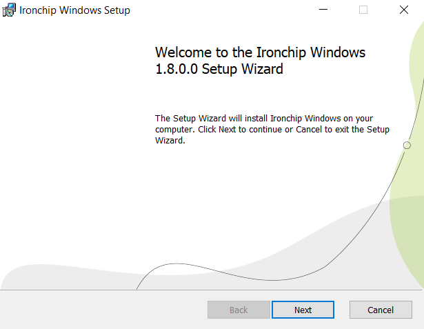
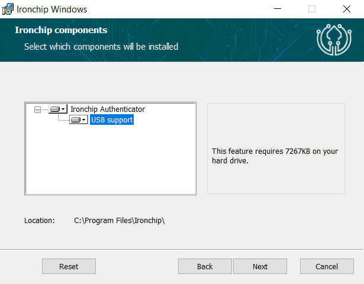

<p align="center">
  
</p>
<h1 align="center">Ironchip</h1>

<p align="center">
    <a href="https://www.microsoft.com/software-download/">
    
  </a>
  
  <a href="https://github.com/Ironchip-Security/Ironchip-Windows/releases/latest">
    
  </a>
  
  <a href="https://github.com/Ironchip-Security/Ironchip-Windows/releases/latest">
    
  </a>
</p>

## IDENTITY PROTECTION

Elevate your cybersecurity strategy with Ironchip Identity Platform, designed to bring the power of Multi-Factor Authentication (MFA) to your desktop computing environment. [Know more](https://www.ironchip.com/en/mobileless-authentication).

**Role-based privilege management:**
Set different user privileges. Prevents unauthorized users from accessing the rest of the system and misusing information, mitigating malicious users.

**Restrict access from unauthorized places:**
Generate enabled access from authorized areas and take your security to the next level.

**Supervision of accesses in real time:**
Check user activity, view access on a timeline, get reports and download them for full control.

**Intrusion detection system (IDS):**
Location-based reporting system to alert of sim swapping, phishing, device switching, etc.

<p align="center">
 <a href="https://www.youtube.com/watch?v=G-rr6BzcQZ0"> 
  
 </a>
</p>

## Download

Download the latest installer (`.msi`) version from [Release](https://github.com/Ironchip-Security/Ironchip-Windows/releases).

> From 1.8.0 onwards, Logon has been moved to its [own repository](https://github.com/Ironchip-Security/Ironchip-Windows-Logon). If you had the Logon feature installed, it will be removed on update, so make sure to install the Logon from the new repository.

## Desktop Application

### What it is

Identity management must be nowadays considered as an essential component for security in organizations. To address this need, Ironchip provides organizations with the scalability and security necessary to offer their users a consistent experience and a reduced risk of vulnerabilities.

**Get a notification on your device**
Communication for authentication is done over a double-encrypted channel which implements a TLS plus asymmetric elliptic key encryption.


### Installing process

To install the Ironchip Authenticator into your device:
 - Run the downloaded installer. This will open the installer stepper:
   <p align="center">
     
   </p>
 - Follow the installation steps until you arrive to the **Component Selection View**. To have the desktop application installed, the **Ironchip Windows Authenticator** must be `enabled`.

   > I case you want to have the **USB support** feature `enabled`, make sure to **enable USB support**.

   <p align="center">
     
   </p>

 - Once the installation process is finished. All you need to do is [enroll the device](https://knowledge.ironchip.com/en/aplicaci%C3%B3n-de-escritorio#registro), and you are good to go.

### Installing process using CLI
The installation of Ironchip Windows using commands (cmd) with the program "msiexec.exe." Here’s a basic tutorial on how to do it:

1) Open the command line (cmd):
    - Press Win + R to open the "Run" dialog.
    - Type "cmd" and press Enter.
2) Locate the MSI file:
    - Make sure you have the MSI file you want to install in an accessible location from the command line.
3) Execute the msiexec command:
    - The basic command to install an MSI file is as follows:

    ```bash
    msiexec.exe /i Path\To\IronchipWindowsLogon.msi /q
    ```

    Replace "Path\To\IronchipWindowsLogon.msi" with the full path and name of the MSI file. The APIKEY will only be necessary if you want to install the Windows Logon functionality, which can be obtained through the following procedure:
    https://docs.ironchip.com/en/windows-logon

    Additionally, if you want a more customized installation, the installer has optional parameters:
    - Customization of the environment -> To do this, the IRONCHIP_HOST property is used to customize the environment you want to target (by default "https://api.ironchip.com").
    - Customization of the features to install -> To do this, the ADDLOCAL property is used to customize the functionalities you want to install. In this case, we have several options (LogonFeature, OfflineFeature, AuthenticatorFeature, USBFeature, CachedPasswordsFeature) that can be combined.

    Example 1: Installation of the desktop application functionality and USB functionality
    ```bash
    msiexec.exe /i IronchipWindowsLogon.msi  IRONCHIP_HOST="https://api.ironchip.com" ADDLOCAL="AuthenticatorFeature,USBFeature" /q
    ```

    Example 2: Installation of the desktop application functionality without the USB functionality
    ```bash
    msiexec.exe /i IronchipWindowsLogon.msi IRONCHIP_HOST="https://api.ironchip.com" ADDLOCAL="AuthenticatorFeature" /q
    ```

    - Proxy configuration -> This configuration is only necessary if you want to enable it, as it is disabled by default. We have disabled, automatic, and manual modes, and for this, several properties are configured:

        - IRONCHIP_PROXY_SELECTED -> This property is used to set the proxy status: none, automatic, or manual.
        - IRONCHIP_PROXY_MANUAL_HOST -> Only necessary if enabling the proxy manually.
        - IRONCHIP_PROXY_MANUAL_PORT -> Only necessary if enabling the proxy manually.

    Example 1: Automatic proxy configuration
    ```bash
    msiexec.exe /i IronchipWindowsLogon.msi  IRONCHIP_HOST="https://api.ironchip.com" IRONCHIP_PROXY_SELECTED="automatic" /q
    ```

    Example 2: Manual proxy configuration
    ```bash
    IRONCHIP_HOST="https://api.ironchip.com" 
    IRONCHIP_PROXY_SELECTED="manual" IRONCHIP_PROXY_MANUAL_HOST="localhost" IRONCHIP_PROXY_MANUAL_PORT="8080" /q
    ```
4) Wait for it to finish:
    - The installation process may take some time. Stay in the command line until you see the prompt indicating that the installation is complete.
  
---

#### MSI Installer Options Summary

Here's a quick reference table for all available properties you can use when installing the MSI via CLI:

| Property                        | Example Value                            | Description                                                                            |
|---------------------------------|------------------------------------------|----------------------------------------------------------------------------------------|
| `IRONCHIP_APIKEY`              | `"12345-abcde"`                          | Required API key to activate Windows Logon or Authenticator features.                 |
| `IRONCHIP_HOST`                | `"https://api.ironchip.com"`             | Custom API host. Defaults to Ironchip's main production environment.                  |
| `ADDLOCAL`                     | `"LogonFeature,OfflineFeature"`          | Features to install (comma-separated): LogonFeature, OfflineFeature, etc.             |
| `IRONCHIP_PROXY_SELECTED`      | `"manual"`                               | Proxy mode: `none` (default), `automatic`, or `manual`.                                |
| `IRONCHIP_PROXY_MANUAL_HOST`  | `"localhost"`                            | Required only if `IRONCHIP_PROXY_SELECTED` is `manual`.                               |
| `IRONCHIP_PROXY_MANUAL_PORT`  | `"8080"`                                 | Required only if `IRONCHIP_PROXY_SELECTED` is `manual`.                               |

> Tip: You can combine these parameters to create tailored installations, as shown in the examples above.

