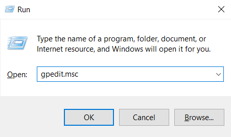
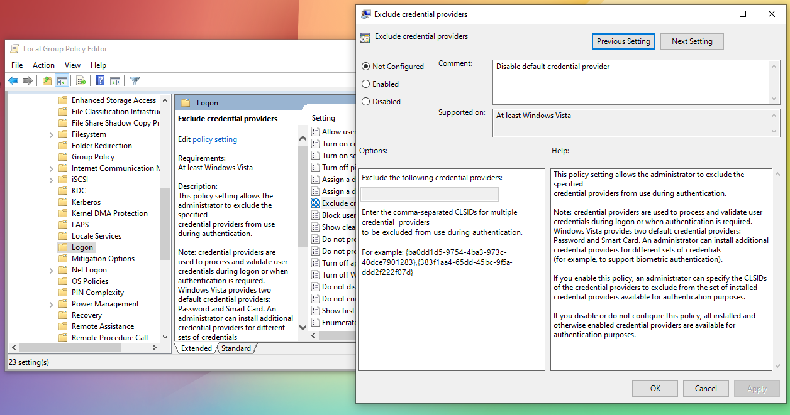

  

<h1 align="center">Ironchip</h1>

    
  
  

## IDENTITY PROTECTION

Elevate your cybersecurity strategy with Ironchip Identity Platform, designed to bring the power of Multi-Factor Authentication (MFA) to your desktop computing environment. [Know more](https://www.ironchip.com/en/mobileless-authentication).

**Role-based privilege management:**
Set different user privileges. Prevents unauthorized users from accessing the rest of the system and misusing information, mitigating malicious users.

**Restrict access from unauthorized places:**
Generate enabled access from authorized areas and take your security to the next level.

**Supervision of accesses in real time:**
Check user activity, view access on a timeline, get reports and download them for full control.

**Intrusion detection system (IDS):**
Location-based reporting system to alert of sim swapping, phishing, device switching, etc.

 

## Repository Deprecation

We have split the original installer (MSI) into two separate installers, each dedicated to a specific feature:  

- [**Ironchip Windows Authenticator**](https://github.com/Ironchip-Security/Ironchip-Windows-Authenticator)  
- [**Ironchip Windows Logon**](https://github.com/Ironchip-Security/Ironchip-Windows-Logon)  

### Important changes

- **Windows Logon** now has a **unique installation GUID**, meaning no data from previous Logon versions will be transferred to the new installation.  

- **Windows Authenticator** keeps the **same GUID**, so all existing application data will be preserved. However, **make sure to remove the Logon configuration before updating**, as the Logon feature will be removed during the update process.

### Revert disable default credential provider

In order to revert to force user to use **Ironchip Credential Provider**, the default **Windows Credential Provider** must be enabled again.

> The paths may vary depending on the language
#### Steps:
- Use the key shortcut `⊞ Win` + `R` and paste `gpedit.msc`

  

- Then inside the **Local Group Policy Editor** go to `Local Computer Policy > Computer Configuration > Administrative Templates > System > Logon > Exclude Credential Providers`

- Set to **Disabled** or **Not Configured** the exclusion rule and remove the GUID of the Windows Password Credential Provider from the field. Then press apply.

  

